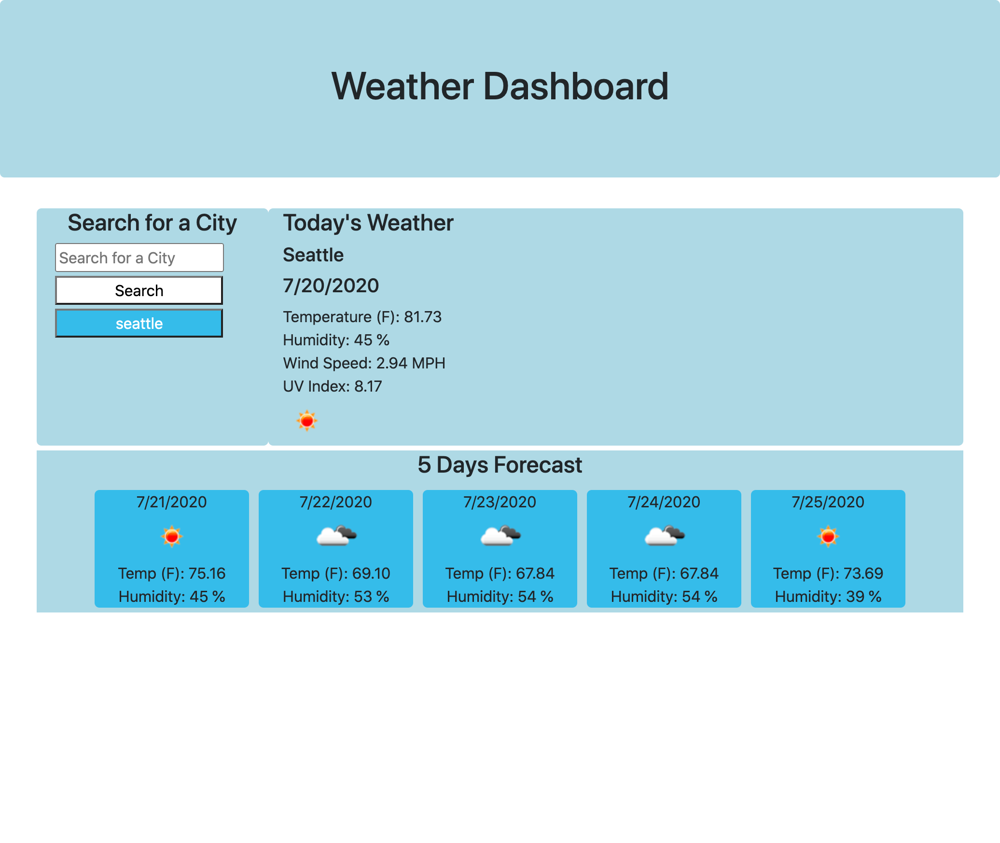

# weather-dashboard
About the project:

Weather application to view weathers in current city that is searched. 

Imager preview:

Description of project:

-Semantic HTML elements are used.

-CSS used for simple styling

-Structures are in logical structures in positioning and styling.

-Bootstrap grid system used for responsive layout.

-Javascript used

-Local strage is used for storing.

-API used for weather information (https://openweathermap.org/api).

Deployed Link:

https://juleeb.github.io/weather-dashboard/
